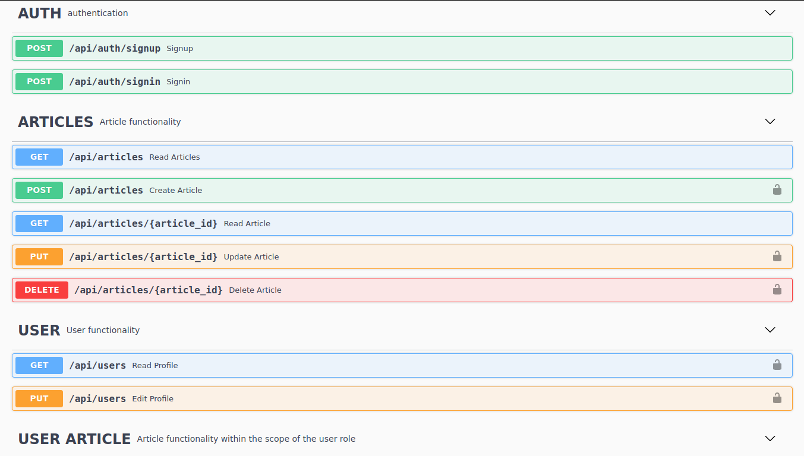

# CRUD Restful API using Sequelize and Swagger

CMS CRUD Restful API with authentication and authorization. Using PostgreSQL as DBMS and Sequelize as its ORM. Documentation is served using Swagger.

## Screenshot



## Requirement

> 1.  npm v6.14.8
> 2.  Node.js v12.19.0
> 3.  PostgreSQL v10.14

## Installation

1. Open terminal, then execute this command :

```
git clone git@github.com:DonzTea/cms-crud-restful-api.git
```

2.  Enter the cloned project with this command :

```
cd cms-crud-restful-api
```

3.  Install packages and dependencies with this command :

```
npm install
```

4.  Rename `.env.example` file to `.env`

5.  Open `.env` file, set environment variables as you wish, then save.

## Running Server Locally

1.  Make sure the PostgreSQL database service is started.
2.  Run `npm run dev` command.
3.  Open `http://localhost:3000/api-docs` in the browser.
